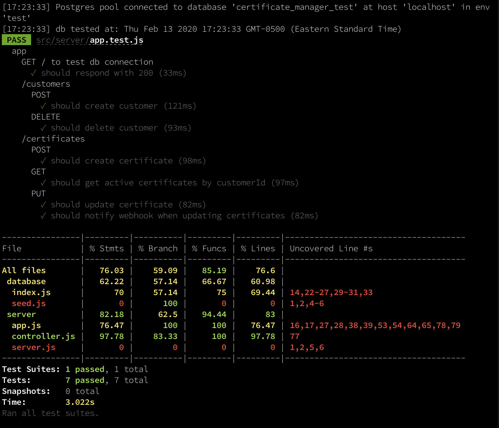

# Certificate Manager API

## Setup

### To start API server at 'localhost:3000': 
- ensure docker is running
- clone repo to local machine
- run the following command from repo directory:

```
docker-compose up -d
```

### To shutdown webserver at 'localhost:3000':
- run the following command from repo directory:
```
docker-compose down
```

### Route descriptions:
- Examples API calls here: [endpoints](./test-utils/APItests.http)
- The linked descriptions are manual tests most efficiently run in VS Code using the 'REST Client' extension.  They could also be ported to CURL using the examples as starting points.


### To run automated tests: 
- Using npm and local postgres database with user 'test' and password 'test'
- clone repo to local machine
- run the following commands from repo directory:
```
npm install
npm run test
```
- To alter database user and password:
[Test setup config](./test-utils/globalTestSetup.js)
- Test results:

